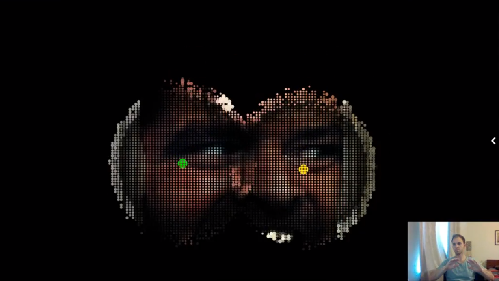

# Kinect Server
Kinect Server is a wrapper for Microsoft Kinect V2, implemented as a Web Socket server, optmized for browser access.
The idea was explore browser-based interactive applications with Kinect, using technologies such as WebGL and/or related libraries such as THREE.JS. 

Typically such Kinect applications are client applications, developed in C#, C++ or Java, and running in a computer where Kinect drivers are installed.
Due to high-throughput of Kinect sensor streams, compromises and alternative solutions were made to ensure application could run smoothly.

# Web Socket client example
Here a web socket client was created as part of a [P5.JS](https://p5js.org) sketch, and the position of the hands is steering the animation in the browser. 

